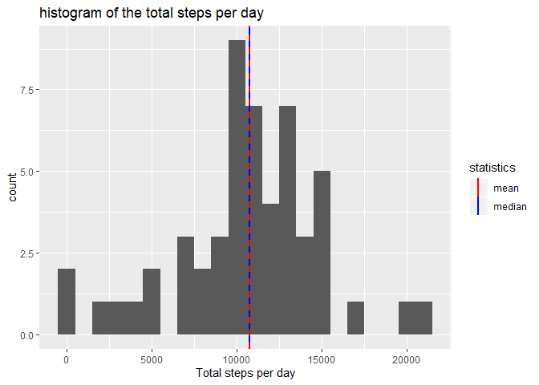
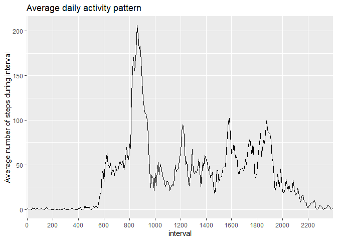
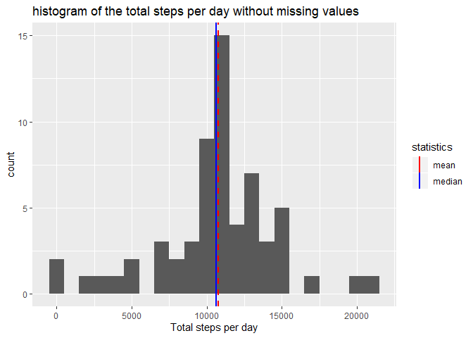
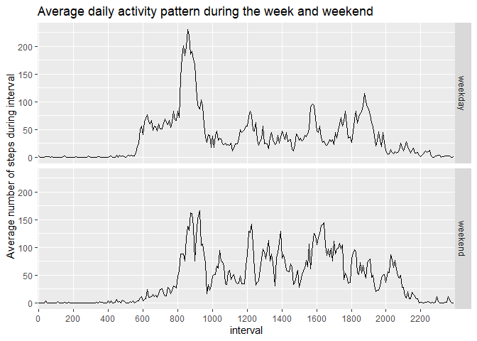

# Reproducible Research Project Report Part 1
This is document is created to complete the course on Coursera: Reproducible Research by John Hopkins University. 
It is part of the Peer-graded Assignments. 
This report addresses the first assignment of the course, which is given in week 2.

## Overview
This assignment makes use of data from a personal activity monitoring device. This device collects data at 5 minute intervals through out the day. The data consists of two months of data from an anonymous individual collected during the months of October and November, 2012 and include the number of steps taken in 5 minute intervals each day.

The data for this assignment can be downloaded from the course web site:

* Dataset: [Activity monitoring data](https://d396qusza40orc.cloudfront.net/repdata%2Fdata%2Factivity.zip)

This report presents the investigation of this dataset. The report shows:

* Loading and preprocessing the data.
* The mean total number of steps taken per day.
* The average daily activity pattern.
* The consequence of Missing values.
* THe differences in activity patterns between weekdays and weekends


## Loading and preprocessing the data

```r
# Load libraies
library(ggplot2)
library(dplyr)
```

```
## 
## Attaching package: 'dplyr'
```

```
## The following objects are masked from 'package:stats':
## 
##     filter, lag
```

```
## The following objects are masked from 'package:base':
## 
##     intersect, setdiff, setequal, union
```

```r
# set local timezone to english, otherwise weekdays will not be printed in English
Sys.setlocale("LC_TIME","English")
```

```
## [1] "English_United States.1252"
```

```r
# Unzip data
fp_data <- "activity.zip"
unzip(fp_data)
# Load CSV
activity <- read.csv("activity.csv")

# Convert the variable interval to a factor variable
activity$interval <- as.factor(activity$interval)
```

Show the structure and the summary of the dataset. 


```r
str(activity)
```

```
## 'data.frame':	17568 obs. of  3 variables:
##  $ steps   : int  NA NA NA NA NA NA NA NA NA NA ...
##  $ date    : Factor w/ 61 levels "2012-10-01","2012-10-02",..: 1 1 1 1 1 1 1 1 1 1 ...
##  $ interval: Factor w/ 288 levels "0","5","10","15",..: 1 2 3 4 5 6 7 8 9 10 ...
```

```r
summary(activity)
```

```
##      steps                date          interval    
##  Min.   :  0.00   2012-10-01:  288   0      :   61  
##  1st Qu.:  0.00   2012-10-02:  288   5      :   61  
##  Median :  0.00   2012-10-03:  288   10     :   61  
##  Mean   : 37.38   2012-10-04:  288   15     :   61  
##  3rd Qu.: 12.00   2012-10-05:  288   20     :   61  
##  Max.   :806.00   2012-10-06:  288   25     :   61  
##  NA's   :2304     (Other)   :15840   (Other):17202
```

## What is mean total number of steps taken per day?

```r
# NA values are not considered
activity_nona = na.omit(activity)

# Sum total number of steps per day
stepsperday <- aggregate(activity_nona$steps, by=list(date=activity_nona$date), FUN=sum)
names(stepsperday)[2] <- "totalsteps"

# Compute mean and median
mean_steps = mean(stepsperday$totalsteps)
med_steps = median(stepsperday$totalsteps)

# Plot
sp <- ggplot(data=stepsperday, aes(x=totalsteps)) + geom_histogram(binwidth = 1000)
sp +  
  geom_vline(aes(xintercept=med_steps,color="median"),size=1) + 
  geom_vline(aes(xintercept=mean_steps,color="mean"), linetype="dashed",size=1) + 
  scale_color_manual(name = "statistics", values = c(median = "blue", mean = "red")) + 
  ggtitle("histogram of the total steps per day") + 
  xlab("Total steps per day")
```

<!-- -->

The mean of the total number of steps during a day is 10766.2.   
The median of the total number of steps during a day is 10765.   

## What is the average daily activity pattern?

```r
# NA values are not considered
activity_nona = na.omit(activity)

# Average number of steps per day
stepsperinterval <- aggregate(activity_nona$steps, by=list(interval=activity_nona$interval), FUN=mean)
names(stepsperinterval)[2] <- "averagesteps"

# Compute max stepsperinterval
max_steps <- max(stepsperinterval$averagesteps)
ix_max_interval <- stepsperinterval$averagesteps==max_steps
max_interval <- stepsperinterval[ix_max_interval,]["interval"]

# Plot
sp <- ggplot(data=stepsperinterval, aes(x=interval, y=averagesteps, group=1)) + geom_line()
sp+ scale_x_discrete(breaks=seq(0,2400,200))+ 
  ggtitle("Average daily activity pattern") + 
  ylab("Average number of steps during interval")
```

<!-- -->

The average daily pattern shows, as expected, almost no activity during the noctural hours. From ~ 6.00 AM the activity increases, to peak between 8.00 AM and 9.00 AM, likely the commute to work. During the day smaller peaks around lunch time (12.00 AM), around 16.00 and 18.30. Presumably times that one travels back from work. From 08.00 PM to 10.00 the activity drops again towards zero.   
The interval 835 is the 5-minute interval which, on average across all the days in the dataset, contains the maximum number of steps.

## Imputing missing values

The total number of missing values in the dataset is: 2304. This corresponds to 13.1% of the data. 
To fill the missing values, the average of the 5-minutes interval is used. 


```r
steps_miss_ind <- is.na(activity$steps)
int_miss_ind <- activity[steps_miss_ind,'interval']
fill = vector(length=length(int_miss_ind))
for (i in 1:length(int_miss_ind)) {
  fill[i] = as.integer(stepsperinterval[stepsperinterval$interval==int_miss_ind[i],'averagesteps'])
}
activity_filledna <- activity
activity_filledna[steps_miss_ind,'steps'] <- fill
```


```r
# Plot the average daily pattern
# Sum total number of steps per day
stepsperday2 <- aggregate(activity_filledna$steps, by=list(date=activity_filledna$date), FUN=sum)
names(stepsperday2)[2] <- "totalsteps"

# Compute mean and median
mean_steps2 = mean(stepsperday2$totalsteps)
med_steps2 = median(stepsperday2$totalsteps)

# Plot
sp <- ggplot(data=stepsperday2, aes(x=totalsteps)) + geom_histogram(binwidth = 1000)
sp +  
  geom_vline(aes(xintercept=med_steps2,color="median"),size=1) + 
  geom_vline(aes(xintercept=mean_steps2,color="mean"), linetype="dashed",size=1) + 
  scale_color_manual(name = "statistics", values = c(median = "blue", mean = "red"))+ 
  ggtitle("histogram of the total steps per day without missing values") + 
  xlab("Total steps per day")
```

<!-- -->

By using the 5-minute average to impute missing values, the mean and median are slightly affected and show a limited decrease.  

The new mean of the total number of steps during a day is 10749.8.   
The new median of the total number of steps during a day is 10641.

Statistic | with missing values | with  missing values imputed
------------- | -------------- | -------------
mean | 10766.2 | 10749.8
median | 10765 | 10641

## Are there differences in activity patterns between weekdays and weekends?


```r
# Differ between weekdays and weekend

# Check if date is in weekend
days <- weekdays(as.Date(activity$date))
weekenddays = days == "Saturday" | days == "Sunday"
# create new factor variable which is 'weekend' or 'weekday'
week <- vector(mode="character",length=dim(activity)[1])
week[weekenddays] <- "weekend"
week[!weekenddays] <- "weekday"
# add new factor variable
activity_week <- mutate(activity_filledna,week=factor(week))
```


```r
# Plot average daily activity pattern during the week and weekend 

# Average number of steps per day
stepsperinterval2 <- aggregate(activity_week$steps, by=list(interval=activity_week$interval, week = activity_week$week), FUN=mean)
names(stepsperinterval2)[3] <- "averagesteps"


# Plot
sp <- ggplot(data=stepsperinterval2, aes(x=interval, y=averagesteps, group=1)) + geom_line()
sp + facet_grid(week ~ .)  + scale_x_discrete(breaks=seq(0,2400,200)) +
  ggtitle("Average daily activity pattern during the week and weekend") + 
  ylab("Average number of steps during interval")
```

<!-- -->


